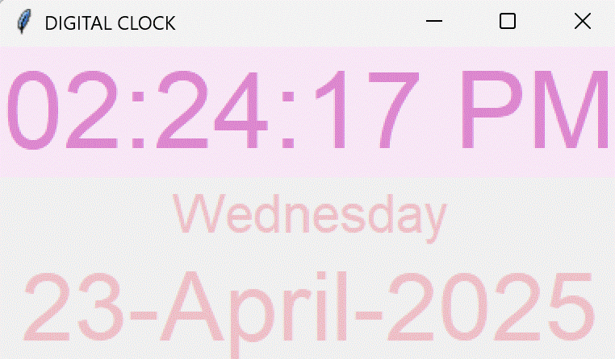

⏰ Digital Clock App using Tkinter ⏰ Python🐍

A simple digital clock application built with Python's Tkinter GUI library.

## Features
- Displays current time (HH:MM:SS) with AM/PM indicator
- Shows current date (Day, Month Date, Year)
- Clean, pink-themed interface
- Updates in real-time (every second)

## Requirements
- Python 3.x
- Tkinter (usually comes with Python standard library)

## How to Run
1. Clone this repository
2. Run the script: `python clock.py`
3. The clock window will appear

## Customization
You can easily modify:
- Font styles and sizes
- Background and foreground colors
- Time/date formats

Feel free to fork and enhance this simple project!
🕒 Tkinter Digital Clock ⏰
 
